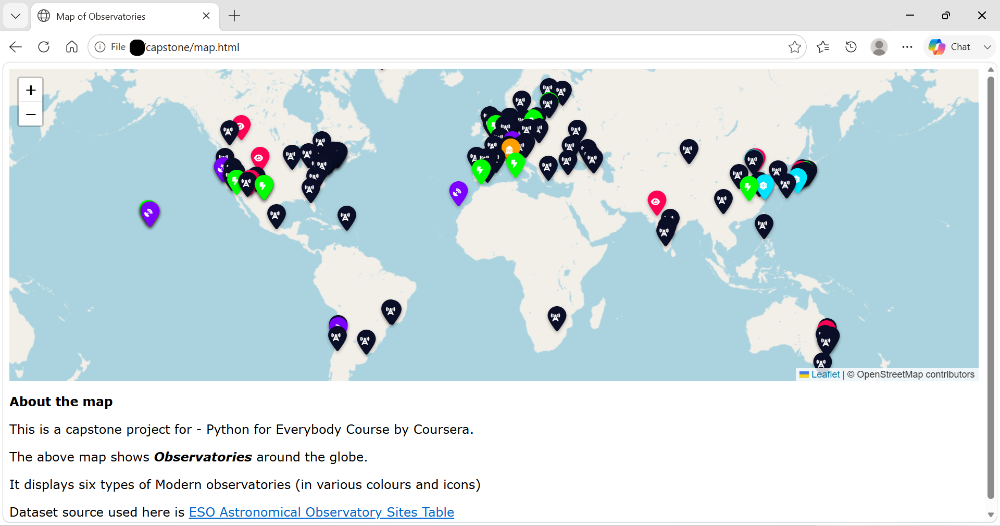

# py4e-capstone-astroplot
"A python-based geospatial data visualizer that plots and color-codes global astronomical observatories on an interactive OpenStreetMap interface. PY4E Capstone Project."

# 🌌 AstroPlot: Mapping Global Observatories with OpenStreetMap
### A PY4E Capstone Journey from Nested JSON to Interactive Geo-Visualizations

[](https://www.python.org/)
[](#)
[](#)
[](https://opensource.org/licenses/MIT)

> **Project Mission:** Transforming a chaotic, nested raw astronomical dataset into an elegant, interactive frontend map that isolates, filters, and color-codes 6 distinct types of global observatories across an OpenStreetMap canvas.

---
<p align="center">
  
</p>

## 📖 The Story & Data Pipeline

As any data engineer knows, **clean data implies good results**. This project showcases the complete end-to-end decoupling of a messy, multi-era raw telescope registry into a optimized, user-facing geospatial dashboard.

| Pipeline Phase | File / Data State | Technical Transformation & Story |
| :--- | :--- | :--- |
| **Phase 1: Raw Ingestion** | `eso_data_old.json` | Downloaded the initial raw dataset, which proved highly unoptimized and messy due to deep nesting of data entries and redundant attributes. |
| **Phase 2: Data Preprocessing & Sanitization** | `fix_json.py` <br> &rarr; <br> `eso_data.json` | **The Critical Step:** Parsed and flattened deeply nested JSON structures into a clean, uniform dataset. Extracted only the required observatory attributes, handled missing values, eliminated redundant information, and standardized the data format. This preprocessing stage established the single source of truth for every downstream transformation in the pipeline. |
| **Phase 3: Relational Ingestion** | `load_modern.py` <br> &rarr;<br> `observatories.sqlite` | Performed complex data slicing and string indexing on rows to structure a robust relational database. The resulting database stores a complete historical record spanning both **ancient and modern** observatories, giving developers full query flexibility to isolate eras. |
| **Phase 4: Targeted Extraction** | `dump_modern.py` <br> &rarr; <br> `6 Javascript Files` | Executed targeted SQL queries to fetch exclusively **non-empty (`NOT NULL`) modern records**. Applied a custom **restricted word check** mapping algorithm to split pure telescope records automatically into **6 isolated JavaScript array configurations** (such as Radio, Laser, and Infrared/IR bands). |
| **Phase 5: Interactive Map** | `map.html` | Integrated the **OpenStreetMap API**, dynamically plotting the coordinate arrays. Every single observatory type is assigned a **custom icon and unique color profile** (6 distinct combinations) creating an instantly scannable, interactive user experience. |

---

## 💡 Key Technical Implementations

* **The Data Quality Priority:** Emphasized a clean-first pipeline mindset. Isolating target metrics within `eso_data.json` minimized execution overhead during database insertion phases.
* **Dual-Era Schema Design:** The database `observatories.sqlite` acts as a historical ledger. While this specific pipeline isolates modern entries, the relational layout leaves room for querying historic or ancient observation milestones effortlessly.
* **Restricted Keyword Routing:** `dump_modern.py` checks string entries against forbidden or explicit keyword lists to seamlessly segment instrument types (Radio, Laser, IR) before deploying data assets to the web directory.

---

## 💻 Tech Stack

- **Backend / Pipeline:** Python 3 (`urllib`, `json`, `sqlite3`,`codecs`, `http`)
- **Database:** SQLite3 (Relational Storage)
- **Frontend Presentation:** HTML5, JavaScript, OpenStreetMap Layouts (Leaflet Framework), **Font Awesome (Custom Icon Vectoring)**

---

## 🚀 How to Run the Pipeline

Execute the data pipeline sequentially to process records from raw JSON structure to your localized map server.

1. 🧹 **Clean & Load Database:** Process the sanitized arrays, slice row data, and initialize the SQLite ledger.
    
3. 🔎 **Filter & Dump Modern Assets:** Run keyword-restricted checks to generate the 6 distinct classified asset files.
    
3. 🌐 **Launch the Geolocation UI:** Launch the web frontend inside any standard internet browser.

     
## 📂 Repository Breakdown 

```text
├── data/
│   ├── eso_data_old.json  # Original unoptimized dataset containing nested data nodes
│   └── eso_data.json      # Sanitized intermediate dataset structured as a uniform array list
├── script/
│   ├── load_modern.py     # Relational data extraction, row slicing, and index assignment script
│   └── dump_modern.py     # Query analyzer handling restricted word categorization algorithms
├── observatories.sqlite   # Comprehensive SQLite database tracking ancient and modern observatories
├── map.html               # Main interactive canvas rendering OpenStreetMap, Font Awesome icons & 6 custom colored map markers
└── map_type.js            # Destination path storing the 6 color-coded telescope array records
```
---
## 🎓 Capstone Context
This project serves as the technical capstone for the **Python for Everybody (PY4E)** specialization from the University of Michigan. It highlights an end-to-end understanding of decoupling a software architecture into modular ingestion, parsing, database management, and interactive consumer-facing applications.

***
*Developed by [Vedika](https://github.com/VedikaA-work) | PY4E Capstone Showcase*
